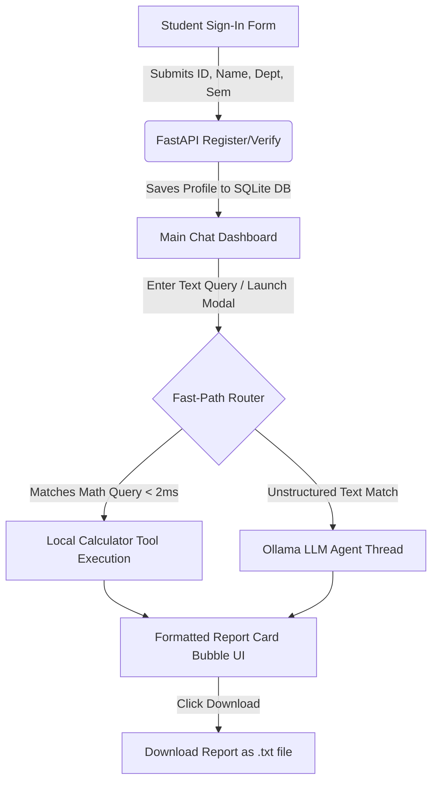

# SmartCollege AI Assistant

An enterprise-grade college assistant portal powered by a FastAPI Python backend, LangChain Tool Calling agents, and a highly polished responsive web frontend. The assistant features a **High-Speed Regex Router** to execute mathematical calculations (GPA, CGPA, Tuition Fee, Attendance, Library Fines, Hostel Rent) in under 2 milliseconds and falls back to a local Ollama LLM for complex unstructured queries.

---

## 🛠 How It Works (Workflow)



1. **Secure Registration**: The student logs in via the Sign-In overlay. The portal checks for ID duplicates and stores the student's name, ID (prefixed with `ST`), custom department, and current semester in a local SQLite database (`college_assistant.db`).
2. **Interactive Calculators**: The student can launch customized prompts (GPA, CGPA, Attendance, Tuition Fee, Library Fine, Hostel Rent) or build a Consolidated Report by selecting checkbox modules.
3. **High-Speed Execution**:
   - If the text query matches standard calculation formats, the backend intercepts it immediately using a **Fast-Path Regex Router**, computing and rendering the results in under 2 milliseconds.
   - If the query is conversational or unstructured, it falls back to a LangChain-Ollama LLM agent thread.
4. **Report Audits**: The interface generates formatted report cards in the chat. Users can click the **Download Report** button to save calculations locally.

---

## 💡 Example Queries to Try

You can test the assistant by typing or copying the following queries directly into the chat:

### 1. Attendance Check
> `Calculate attendance for attended classes 68 out of 75.`
*Calculates attendance rate (90.67%) and outputs VIT exam eligibility status.*

### 2. GPA Score (VIT Method)
> `Calculate GPA for grades ["S","A","B"] with credits [4,3,4]`
*Multiplies credit values by VIT grade points (S=10, A=9, B=8) and computes the average GPA.*

### 3. Cumulative CGPA Tracker
> `Calculate CGPA for semester GPAs [9,9.5,8.8] with semester credits [24,25,23]`
*Calculates credit-weighted cumulative CGPA across multiple semesters.*

### 4. Tuition Fee Balances
> `Calculate pending fee for total fee 250000 and paid fee 150000.`
*Returns the remaining tuition fee balance details.*

### 5. Custom Library Overdue Fines
> `Calculate library fine for book returned 8 days late at a fine rate of ₹10 per day.`
*Calculates overdue fine using the custom fine rate.*

### 6. Hostel Rent Charges
> `Hostel fee is 6000 per month and I stayed for 5 months. Calculate my hostel fee.`
*Computes cumulative hostel charges.*

### 7. Consolidated Report
> `Generate a Consolidated Academic Report with the following items: Attendance Details: Attended classes 68 out of 75 lectures. Tuition Fee Details: Total fee ₹250000 and paid amount ₹150000.`
*Generates a single, combined report sheet featuring multiple calculations at once.*

---

## 🎨 Layout & Key Features

*   **Sleek Floating Navigation**: A modern, glassmorphic header navbar (`rounded-2xl`, drop shadow, `backdrop-blur-md`) that adapts responsively to desktop and mobile layouts.
*   **Widescreen Chat Titles**: Displays the user's full queries in the header on desktop viewports without truncation.
*   **Adjustable Sidebar Drawer**: Resize the sidebar boundary dynamically (between `220px` and `480px`) with click-and-drag. Sizing preferences are saved automatically in `localStorage`.
*   **Excel Student Sheet**: Click the **Student Database Details** button in the sidebar to display registered student accounts in a structured spreadsheet grid.
*   **Editable Fine Rates**: Custom overdue rate fields next to Late Days inside the Library Fine modal, marked with an editing pen icon indicator.
*   **Module Selection**: Checkboxes to toggle specific report sections inside the Consolidated Report builder.

---

## ⚙️ Local Setup Instructions

### 1. Backend Server Setup
Ensure Python 3.9+ is installed. Navigate to the project root and install dependencies:
```bash
pip install -r requirements.txt
```
Launch the FastAPI development backend server:
```bash
uvicorn Smart_College_Assistant:app --reload --port 8000
```
The server will start running on `http://localhost:8000`.

### 2. Frontend Launch
Open `index.html` directly in any web browser by double-clicking it, or serve it using a live server extension (e.g., Live Server on VS Code at port 5500).

---

## 🚀 Deployment Instructions

### 1. GitHub Repository
Initialize and push your project to a new GitHub repository:
```bash
git init
git add .
git commit -m "Initialize SmartCollege Assistant Portal"
git branch -M main
git remote add origin https://github.com/YOUR_USERNAME/YOUR_REPOSITORY.git
git push -u origin main
```

### 2. Backend Deployment (Render)
1. Log in to [Render](https://render.com) and create a new **Web Service**.
2. Connect your GitHub repository.
3. Configure settings:
   - **Runtime**: `Python`
   - **Build Command**: `pip install -r requirements.txt`
   - **Start Command**: `uvicorn Smart_College_Assistant:app --host 0.0.0.0 --port $PORT`
4. Configure Environment Variables:
   - Under the **Environment** tab, click **Add Environment Variable**:
     - **Key**: `PYTHON_VERSION`
     - **Value**: `3.11.9`
5. Deploy the service to get your public backend URL (e.g., `https://smart-college-backend.onrender.com`).

### 3. Frontend Deployment (Vercel)
1. Log in to [Vercel](https://vercel.com) and click **Add New** -> **Project**.
2. Select your GitHub repository.
3. Leave framework presets and build commands default/empty (since the project is pure HTML/CSS/JS).
4. Click **Deploy** to publish the portal on your vercel domain (e.g., `https://smart-college-portal.vercel.app`).

### 🔗 Connecting Frontend (Vercel) to Backend (Render)
Instead of modifying any code, you can easily connect your deployed Vercel site to your Render backend directly from the UI:
1. Open your deployed Vercel frontend site in the browser.
2. Click the **API Settings** gear icon located at the bottom-left of the sidebar (next to the sign-out/info buttons).
3. Paste your public Render Backend URL (e.g., `https://smart-college-backend.onrender.com`) into the input field and click **Save Settings**.
4. The page will reload and start communicating with your live Render backend server!
